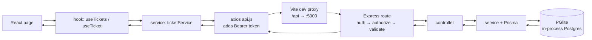

# Student Support System

A full-stack support–ticket management system for college students and support representatives.

- **Students** create tickets, track their status, edit/delete their own open tickets, and chat with support.
- **Support agents** see every ticket, search/filter them, change status & priority, and reply to students.

The frontend is organized **by feature, not by role**: there is **one** role-aware page for each concept (Dashboard, Tickets list, Ticket details). The logged-in user's role decides what each page renders, so there is no duplicated student/support code.

---

## Tech stack

| Layer | Technology |
| --- | --- |
| Frontend | React 19, React Router 7, Vite, Bootstrap 5 + Bootstrap Icons, Axios |
| Backend | Node.js, Express 5, Prisma 7 |
| Database | Embedded **PGlite** — in-process Postgres (`@electric-sql/pglite` + `pglite-prisma-adapter`); no separate DB server |
| Auth | JWT (Bearer token) + bcrypt password hashing |

---

## Repository structure

This is a small monorepo with three top-level folders:

```
StudentSupportSystem-dev/
├── shared/
│   └── constants.json          # SINGLE source of truth for categories, priorities,
│                               # statuses & validation limits — used by BOTH apps
├── client/                     # React frontend (Vite)
└── server/                     # Express + Prisma backend (embedded PGlite database)
```

### Frontend (`client/src/`)

```
client/src/
├── main.jsx                    # App entry: mounts React, loads Bootstrap + App.css, wraps <App/> in <BrowserRouter>
├── App.jsx                     # All routes (public + protected) live here
├── App.css                     # All custom styling (Bootstrap is the base)
│
├── lib/                        # Pure, framework-agnostic helpers (no React)
│   ├── constants.js            # Re-exports CATEGORIES / PRIORITIES / STATUSES / LIMITS from shared/constants.json
│   ├── ticketFormat.js         # Status/priority CSS class helpers, category icons, date formatters
│   └── validation.js           # validateTicketForm() and validateReply()
│
├── hooks/                      # Reusable stateful logic
│   ├── useCurrentUser.js       # Reads the logged-in user from localStorage (once)
│   ├── useTickets.js           # Loads the ticket list (sorted) + loading/error state
│   └── useTicket.js            # Loads a single ticket by id + loading/error state
│
├── components/
│   ├── Navbar.jsx              # Top navigation; links differ by role
│   ├── ProtectedRoute.jsx      # Redirects to /login when not authenticated
│   ├── TicketCard.jsx          # Ticket card used in student lists/dashboard
│   ├── ui/                     # Small generic presentational pieces
│   │   ├── LoadingState.jsx
│   │   ├── ErrorState.jsx
│   │   ├── EmptyState.jsx
│   │   ├── StatusBadge.jsx
│   │   └── PriorityBadge.jsx
│   └── ticket/                 # Ticket-specific building blocks
│       ├── TicketStatsGrid.jsx     # The 4 dashboard stat cards
│       ├── TicketConversation.jsx  # The comment thread
│       ├── ReplyForm.jsx           # Self-contained reply box
│       ├── TicketForm.jsx          # Shared create/edit form
│       └── DeleteTicketModal.jsx   # Delete confirmation dialog
│
├── layouts/
│   └── AppLayout.jsx           # Navbar + page container (<Outlet/>) for all protected pages
│
├── pages/
│   ├── auth/
│   │   ├── LoginPage.jsx
│   │   └── RegisterPage.jsx
│   ├── DashboardPage.jsx       # Role-aware dashboard
│   ├── TicketsPage.jsx         # Role-aware ticket list
│   ├── TicketDetailsPage.jsx   # Role-aware ticket details
│   └── CreateTicketPage.jsx    # Student-only "new ticket" page
│
└── services/                   # The only place that talks to the backend
    ├── api.js                  # Axios instance + JWT/401 interceptors
    ├── authService.js          # login / register / logout / getCurrentUser
    └── ticketService.js        # All ticket-related API calls
```

### Backend (`server/`)

```
server/
├── prisma/
│   ├── schema.prisma           # User, Ticket, Comment models + enums (data-model source of truth)
│   ├── init.sql                # Idempotent DDL applied to PGlite on startup (mirrors schema.prisma)
│   ├── migrations/             # SQL migration history (reference only; not run against PGlite)
│   ├── seed.js                 # Demo users, tickets & comments
│   └── .pglite/                # Embedded database files (auto-created, git-ignored)
└── src/
    ├── index.js                # Express app: bootstraps the DB (initDb) then CORS, JSON, routes, listen
    ├── constants.js            # Re-exports shared/constants.json for the server
    ├── config/
    │   ├── env.js              # Loads & validates .env (JWT_SECRET required; DATABASE_DIR optional)
    │   ├── db.js               # PGlite instance + Prisma adapter + initDb() schema bootstrap
    │   └── prismaClient.js     # Re-exports the shared PrismaClient from db.js
    ├── middleware/
    │   ├── auth.js             # Verifies JWT, attaches req.user
    │   ├── authorize.js        # Role gate, e.g. authorize('SUPPORT')
    │   ├── validate.js         # Declarative request-body validation
    │   └── errorHandler.js     # Turns thrown errors into clean JSON
    ├── routes/
    │   ├── auth.routes.js
    │   └── ticket.routes.js
    ├── controllers/            # Request/response handling + input checks
    │   ├── auth.controller.js
    │   └── ticket.controller.js
    ├── services/               # Business logic + all Prisma queries
    │   ├── auth.service.js
    │   └── ticket.service.js
    └── utils/
        └── ApiError.js         # Error class carrying an HTTP status code
```

---

## How it all fits together

### Request lifecycle (end to end)



1. A **page** renders and calls a **hook** (`useTickets`, `useTicket`) or a **service** function directly.
2. The **service** (`ticketService` / `authService`) calls the shared **axios instance** (`api.js`).
3. `api.js` automatically attaches the JWT as an `Authorization: Bearer <token>` header.
4. In development, Vite proxies any `/api/*` request to the backend at `http://localhost:5000`.
5. Express runs the route's **middleware chain** → **controller** → **service** → **Prisma** → **PGlite** (the embedded, in-process Postgres).
6. The service formats the DB row into the shape the frontend expects (e.g. `OPEN` → `"Open"`) and the response travels back up.

> **Separation of concerns:** components never call `axios` directly, and the backend never trusts the client — every protected route re-checks identity (JWT) and permissions (role) on the server.

### Authentication flow

1. **Login** — `LoginPage` calls `authService.login({ email, password, role })` → `POST /api/auth/login`. On success the server returns `{ token, user }`, and `authService` stores both in `localStorage`.
2. **Authorized requests** — `api.js`'s request interceptor reads the token from `localStorage` and adds the `Authorization` header to every call.
3. **Route protection** — `ProtectedRoute` checks `localStorage` for a user; if none, it redirects to `/login`. `AppLayout` reads the user via `useCurrentUser()` and passes the role to `Navbar`.
4. **Session expiry** — if any response is `401`, `api.js`'s response interceptor clears `localStorage` and redirects to `/login`.
5. **Logout** — `authService.logout()` clears `localStorage`; `Navbar` then navigates to `/login`.

### Role-aware rendering (why there are no duplicate pages)

Each concept is a **single page** that branches on `useCurrentUser().role`:

| Page | Student sees… | Support sees… |
| --- | --- | --- |
| `DashboardPage` | Unread-reply banner, stat cards, **recent tickets as cards**, "Create Ticket" | Stat cards, "Urgent / Work Summary" widgets, **recent tickets as a table**, "View All" |
| `TicketsPage` | Their tickets as **cards** + total count | Search/status/priority/category **filters + table** with student column |
| `TicketDetailsPage` | Conversation + reply, plus **Edit / Delete** on open tickets | Conversation + reply, plus a **status & priority management** panel |

Shared building blocks (`TicketStatsGrid`, `TicketConversation`, `ReplyForm`, `TicketForm`, badges, etc.) are reused inside both branches, so the role-specific code stays tiny.

### Single source of truth: `shared/constants.json`

Categories, priorities, statuses, and validation limits are defined **once** and consumed by both apps:

- **Client** imports it through the `@shared` alias (configured in `vite.config.js`, which also sets `server.fs.allow` so Vite can read the repo-root folder). See `client/src/lib/constants.js`.
- **Server** imports it with a plain `require` in `server/src/constants.js`, and uses it in `ticket.routes.js` (validation rules) and `ticket.controller.js` (enum/limit checks).

Add a category in one place and it appears in the student's dropdown **and** is accepted by the server. Note: categories are free-form text in the DB, but **priorities and statuses are also enums** — adding a new one of those additionally requires updating `schema.prisma` + `prisma/init.sql`.

---

## Frontend reference

### `lib/`

- **`constants.js`** — imports `@shared/constants.json` and exports `CATEGORIES`, `PRIORITIES`, `STATUSES`, `LIMITS`.
- **`ticketFormat.js`**
  - `getStatusClass(status)` / `getPriorityClass(priority)` — map a value to its Bootstrap/custom CSS classes.
  - `getPriorityBorderClass(priority)` — the colored left border on `TicketCard`.
  - `getCategoryIcon(category)` — Bootstrap-Icons class for a category.
  - `formatDate(value)` — `dd Mon yyyy`; `formatDateTime(value)` — adds `HH:mm`. Both guard invalid dates.
- **`validation.js`**
  - `validateTicketForm(form)` → returns an `errors` object (empty = valid) for title/description/category/priority using `LIMITS`.
  - `validateReply(message)` → returns an error string (empty = valid).

### `hooks/`

- **`useCurrentUser()`** → the logged-in user object (or `null`), read once from `localStorage`.
- **`useTickets()`** → `{ tickets, loading, error, reload }`. Calls `getTickets()` (the backend returns the student's own tickets or all tickets based on role) and sorts by `updatedAt` desc.
- **`useTicket(ticketId)`** → `{ ticket, setTicket, loading, error }`. `setTicket` lets pages update the ticket in place after a reply/edit without a refetch.

### `components/`

- **`Navbar.jsx`** — props: `role`. Brand links to `/dashboard`. Students get Dashboard / My Tickets / Create Ticket; support gets Dashboard / All Tickets + their name. Includes Logout.
- **`ProtectedRoute.jsx`** — props: `children`. Renders them only if a user is in `localStorage`, otherwise redirects to `/login`.
- **`TicketCard.jsx`** — props: `ticket`. A self-contained card (icon, title, truncated description, category/priority/status, date) linking to `/tickets/:id`. Uses `StatusBadge`, `PriorityBadge`, and `ticketFormat`.

### `components/ui/`

- **`LoadingState`** — props: `message`. Centered spinner.
- **`ErrorState`** — props: `message`. Red alert box.
- **`EmptyState`** — props: `icon`, `title`, `description`, `children`. Dashed "nothing here" box; `children` is an optional action (e.g. a button).
- **`StatusBadge`** — props: `status`, `dot`. Colored status pill (`dot` shows a leading dot).
- **`PriorityBadge`** — props: `priority`, `icon`. Colored priority pill (`icon` shows a leading flag, default on).

### `components/ticket/`

- **`TicketStatsGrid`** — props: `tickets`. Computes and renders the Total / Open / In Progress / Resolved cards.
- **`TicketConversation`** — props: `comments`. The message thread (support vs student styling per message); shows its own empty state.
- **`ReplyForm`** — props: `onSubmit(message)`, `label`, `placeholder`. Owns its textarea, character counter, validation (`LIMITS.reply`), and submitting state; clears itself on success.
- **`TicketForm`** — props: `initialValues`, `onSubmit(values)`, `onCancel?`, `submitLabel`, `submittingLabel`, `submitIcon`. The shared title/category/priority/description form with validation and counters. Used for both **creating** (`CreateTicketPage`) and **editing** (student details).
- **`DeleteTicketModal`** — props: `ticketTitle`, `onConfirm`, `onCancel`. Confirmation dialog that manages its own deleting/error state.

### `pages/`

- **`auth/LoginPage`** — role toggle + email/password, quick-login demo buttons, "show password". On success navigates to `/dashboard`.
- **`auth/RegisterPage`** — name/email/password/confirm. Registers a **student** and returns to `/login`.
- **`DashboardPage`** — role-aware (see table above). Local sub-components: `UnreadRepliesBanner`, `SupportSummary`, `RecentTicketsTable`. Students also fetch `getUnreadReplies()`.
- **`TicketsPage`** — role-aware. Local sub-components: `StudentTicketList` (cards) and `SupportTicketList` (filters + table, with `useMemo`-based filtering).
- **`TicketDetailsPage`** — role-aware. Loads the ticket via `useTicket`; students who don't own the ticket are redirected. Local sub-components: `StudentTicketDetails` (edit + delete) and `SupportTicketDetails` (status/priority panel), both sharing `TicketConversation` + `ReplyForm`.
- **`CreateTicketPage`** — students only (support is redirected to `/tickets`). Renders `TicketForm` + a "tips" sidebar; on submit calls `createTicket` and navigates to the new ticket.

### `services/`

- **`api.js`** — Axios instance with `baseURL: '/api'`. Request interceptor adds the Bearer token; response interceptor logs out + redirects on `401`.
- **`authService.js`** — `login()` (stores token+user), `register()`, `logout()` (clears storage), `getCurrentUser()` (safe JSON parse).
- **`ticketService.js`** — `getTickets`, `getTicketById`, `createTicket`, `addCommentToTicket`, `updateTicket`, `getUnreadReplies`, `updateTicketAsStudent`, `deleteTicket`. A shared `extractError` helper normalizes server error messages.

### Routing (`App.jsx`)

| Path | Access | Component |
| --- | --- | --- |
| `/login` | public | `LoginPage` |
| `/register` | public | `RegisterPage` |
| `/dashboard` | authenticated | `DashboardPage` |
| `/tickets` | authenticated | `TicketsPage` |
| `/tickets/new` | student only | `CreateTicketPage` |
| `/tickets/:ticketId` | authenticated | `TicketDetailsPage` |
| `/` | → | redirect to `/dashboard` |
| `*` | → | redirect to `/login` |

Protected routes are wrapped by `ProtectedRoute` → `AppLayout`. The role is derived from the logged-in user, so the URLs are the same for both roles.

---

## Backend reference

### Middleware

- **`auth.js`** — reads the `Bearer` token, verifies it, loads the user from the DB, and sets `req.user`. Returns `401` on missing/invalid/expired tokens.
- **`authorize(...roles)`** — must run after `auth`; returns `403` if `req.user.role` isn't allowed.
- **`validate(rules)`** — declarative body validation (`required`, `minLength`, `maxLength`, `enum`); collects messages and throws `400`.
- **`errorHandler`** — final middleware; converts any thrown error (especially `ApiError`) into a clean JSON response and includes the stack only in development.

### Auth API

| Method | Path | Access | Purpose |
| --- | --- | --- | --- |
| POST | `/api/auth/login` | public | Verify credentials + role → `{ token, user }` |
| POST | `/api/auth/register` | public | Create a STUDENT account |
| GET | `/api/auth/me` | auth | Return the current user |

### Tickets API (all require auth)

| Method | Path | Role | Purpose |
| --- | --- | --- | --- |
| GET | `/api/tickets` | any | Student: own tickets; Support: all tickets |
| GET | `/api/tickets/unread-replies` | STUDENT | Unread support replies for the dashboard banner |
| GET | `/api/tickets/:id` | any\* | One ticket (\*student must own it; also marks support replies read) |
| POST | `/api/tickets` | STUDENT | Create a ticket (validated against shared constants) |
| PATCH | `/api/tickets/:id` | SUPPORT | Update status and/or priority |
| POST | `/api/tickets/:id/comments` | any\* | Add a comment (\*student must own the ticket) |
| PATCH | `/api/tickets/:id/student-edit` | STUDENT | Edit own ticket — only while status is `Open` |
| DELETE | `/api/tickets/:id` | STUDENT | Delete own ticket — only while status is `Open` |

### Services

- **`auth.service.js`** — `findUserByEmail`, `verifyPassword` (bcrypt), `generateToken` (JWT), role mapping (`STUDENT` ↔ `student`), `registerStudent` (hashes password).
- **`ticket.service.js`** — all Prisma queries plus `formatTicket()`, which flattens relations and maps DB enums to display strings (`IN_PROGRESS` → `"In Progress"`). Also `markRepliesAsRead`, `getUnreadRepliesForStudent`, and ownership/status-guarded `updateTicketByStudent` & `deleteTicket`.

### Data model (`schema.prisma`)

```
User    (id, name, email[unique], password, role[STUDENT|SUPPORT], timestamps)
Ticket  (id, title, description, category, status[enum], priority[enum], studentId → User, timestamps)
Comment (id, message, isRead, ticketId → Ticket [cascade delete], authorId → User, createdAt)
```

A `User` has many `Ticket`s and many `Comment`s. A `Ticket` has many `Comment`s (deleted with the ticket). `isRead` powers the student's "new reply" notifications.

> Because the database runs in-process (PGlite), the schema is **not** applied via `prisma migrate`. The equivalent DDL lives in `prisma/init.sql` and is applied automatically on startup — see [Database (embedded PGlite)](#database-embedded-pglite).

---

## Database (embedded PGlite)

The backend uses **[PGlite](https://pglite.dev)** — a full PostgreSQL compiled to WASM that runs **in-process** inside the Node server. There is **no separate database server and no Docker**: the database lives in a local folder and is persisted between restarts.

**How it's wired**

- **`src/config/db.js`** creates a single `PGlite` instance (data stored in `DATABASE_DIR`, default `server/prisma/.pglite/`), wraps it with the `pglite-prisma-adapter` (`PrismaPGlite`), and builds the shared `PrismaClient` from it. Everything else keeps importing the client from `config/prismaClient.js`, which simply re-exports it — so **all the service/controller code is unchanged**; only the connection layer differs from a classic Postgres setup.
- **Schema bootstrap** — Prisma 7 can't run `prisma migrate` / `db push` against an in-process PGlite database, so `db.js` exposes `initDb()`. On first run it checks whether the `users` table exists and, if not, executes **`prisma/init.sql`** (idempotent DDL that mirrors `schema.prisma`). `initDb()` is awaited in `src/index.js` before the server starts listening, and in `prisma/seed.js` before seeding.
- **Persistence & git** — the data directory (`prisma/.pglite/`) and any `*.pglite` files are git-ignored, so each clone starts with an empty DB that bootstraps itself on first run.

**Reset the database** — delete the data folder and re-seed:

```bash
# from server/
rm -rf prisma/.pglite        # PowerShell: Remove-Item -Recurse -Force prisma\.pglite
npm run seed                 # recreates the schema (initDb) + demo data
```

**Keep `init.sql` in sync with `schema.prisma`** — if you change the Prisma models, regenerate the DDL offline (no DB needed) and fold it into `prisma/init.sql` (kept idempotent so it's safe to re-run):

```bash
npx prisma migrate diff --from-empty --to-schema-datamodel prisma/schema.prisma --script
```

---

## Getting started

### Prerequisites

- Node.js 18+

No database server is required — the backend uses an **embedded PGlite** database (see [Database (embedded PGlite)](#database-embedded-pglite)).

### 1. Backend

```bash
cd server
npm install

# Configure environment
cp .env.example .env
# then edit .env and set JWT_SECRET (DATABASE_DIR is optional)

# Generate the Prisma client
npx prisma generate

# Seed demo data (also creates the embedded PGlite schema on first run)
npm run seed

# Start the API (http://localhost:5000) — applies the schema on startup if needed
npm run dev
```

`.env` keys (see `server/.env.example`):

```
# Database (embedded PGlite — no Docker / no separate DB server)
# Optional: where PGlite stores its files. Defaults to server/prisma/.pglite
# DATABASE_DIR="./prisma/.pglite"

# JWT
JWT_SECRET="your-secret-key-here"
JWT_EXPIRES_IN="7d"

# Server
PORT=5000
```

### 2. Frontend

```bash
cd client
npm install

# Start Vite (http://localhost:5173) — it proxies /api to the backend
npm run dev
```

Open http://localhost:5173.

### Demo accounts (created by `npm run seed`)

| Role | Email | Password |
| --- | --- | --- |
| Student | `student@test.com` | `Student123!` |
| Support | `support@test.com` | `Support123!` |

---

## NPM scripts

**client**

| Script | Does |
| --- | --- |
| `npm run dev` | Start Vite dev server |
| `npm run build` | Production build |
| `npm run preview` | Preview the production build |
| `npm run lint` | Run ESLint |

**server**

| Script | Does |
| --- | --- |
| `npm run dev` | Start the API with nodemon (bootstraps the PGlite schema) |
| `npm start` | Start the API with node |
| `npm run seed` | Reset & seed demo data (also bootstraps the schema) |
